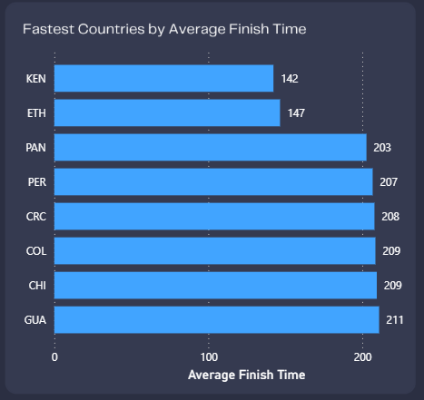
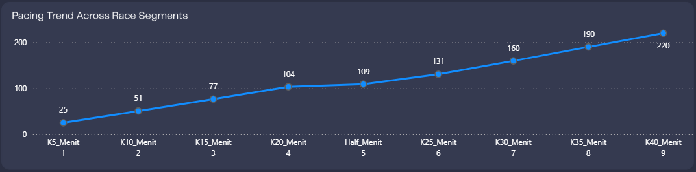

# Marathon Performance Analysis

Welcome to the **Marathon Performance Analysis** repository!

This project focuses on analyzing marathon race data to uncover insights into **runner performance, participation trends, pacing behavior, demographic characteristics, country-level performance, and returning runner progression**.

The project is developed as a portfolio project to demonstrate practical skills in **data analysis, data transformation, SQL, DAX, and Power BI data visualization**.

---

## 🚀 Project Overview

### Objective

Analyze marathon race data to understand how runners perform across different race years, demographic groups, countries, pacing strategies, and repeated race participation.

The analysis aims to transform raw marathon data into meaningful information that can help identify patterns and trends in runner performance.

### Analytical Questions

This project focuses on answering several key questions:

- How has marathon participation changed over time?
- What is the average and median finishing time?
- How does finishing performance differ by gender and age group?
- Which countries have the fastest average finishing times?
- How does runner performance change throughout the marathon?
- How common are positive, negative, and even splits?
- How does performance change among returning runners?

---

## 📊 Key Performance Indicators

| Metric | Value |
|---|---:|
| Total Participants | 80K |
| Average Finish Time | 233.17 min |
| Median Finish Time | 226.50 min |
| Positive Split | 95.63% |
| Negative Split | 4.37% |
| Avg. Returning Runner Change | 11.90 min |
| Performance Worsened | 73.20% |
| Performance Improved | 26.80% |

---

## 📈 Dashboard & Visualization

### Marathon Performance Dashboard


The dashboard was developed using **Power BI** to provide an interactive overview of marathon participation and performance.

The dashboard covers:

- Overall participant performance
- Finish time distribution
- Participation trends
- Gender analysis
- Age group analysis
- Country performance
- Pacing behavior
- Split-time analysis
- Returning runner performance

---

### Participation Trend


The analysis shows relatively stable participation across the analyzed race years:

| Year | Participants |
|---|---:|
| 2015 | ~27K |
| 2016 | ~27K |
| 2017 | ~26K |

---

### Country Performance



The analysis compares average finishing time across countries represented in the dataset.

| Country | Average Finish Time |
|---|---:|
| KEN | 142 min |
| ETH | 147 min |
| PAN | 203 min |
| PER | 207 min |
| CRC | 208 min |
| COL | 209 min |
| CHI | 209 min |
| GUA | 211 min |

These results represent observations within the analyzed dataset and should not be interpreted as a general ranking of marathon runners by nationality.

---

### Pacing Analysis



Runner pacing behavior was analyzed using split-time data throughout the marathon.

The analysis classifies runners into:

- Positive Split
- Negative Split
- Even Split

The results show that **95.63% of runners recorded a positive split**, while **4.37% recorded a negative split**.

This indicates that the majority of runners in the dataset experienced slower performance during the later stages of the marathon.

---

### Returning Runner Analysis


The project also analyzes participants who returned to compete in subsequent races.

| Metric | Value |
|---|---:|
| Average Change in Time | 11.90 min |
| Performance Worsened | 73.20% |
| Performance Improved | 26.80% |

The analysis shows that most returning runners experienced a slower finishing time compared with their previous performance.

---

## 🔎 Key Insights

The analysis identified several key findings:

- Marathon participation remained relatively stable across 2015–2017.
- The average finishing time was higher than the median finishing time.
- Positive split was dominant, accounting for **95.63%** of runners.
- There were substantial differences in average finishing time across countries.
- **73.20%** of returning runners experienced slower performance.
- Only **26.80%** of returning runners improved their finishing time.

These findings provide a broader perspective on marathon performance by combining participation, demographics, pacing behavior, and runner progression.

---

## 🛠️ Tools & Technologies

- **SQL** — Data analysis and querying
- **Power Query** — Data transformation and preparation
- **DAX** — Measures and KPI development
- **Power BI** — Data visualization and dashboard development
- **GitHub** — Project documentation and version control

---

## 🔄 Project Workflow

```text
Raw Dataset
     ↓
Data Understanding
     ↓
Data Cleaning & Transformation
     ↓
Exploratory Data Analysis
     ↓
KPI & DAX Development
     ↓
Power BI Dashboard
     ↓
Insight Generation
